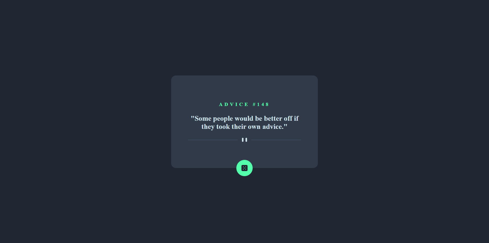
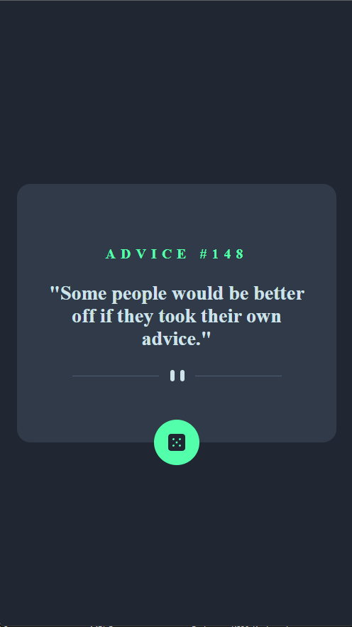

# Frontend Mentor - [Advice generator app](https://www.frontendmentor.io/challenges/advice-generator-app-QdUG-13db)

## Deployed Site
[Advice generator app](https://advice-generator-website.vercel.app/)

## Summary

[Frontend Mentor](https://www.frontendmentor.io) challenge to recreate the [Advice generator app](https://www.frontendmentor.io/challenges/advice-generator-app-QdUG-13db) using React

## Technology Used
#### Front-end
- React
- HTML
- CSS
- Figma
- Vercel for Deployment

## React Component Structure
- index.js
    - src/App.js
        - AdviceGenerator 
        
## Brief About the project

- View the optimal layout for the app depending on their device's screen size
- See hover states for all interactive elements on the page
- Generate a new piece of advice by clicking the dice icon
